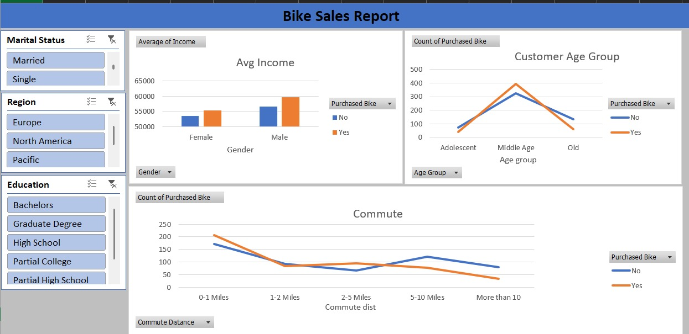

# Bike Sales Analysis Dashboard | Excel

## Business Problem
Analyze customer demographics and purchasing behavior to improve
bike sales performance and marketing decisions.

## Dataset
Customer data including age group, gender, income, education,
region, commute distance, and bike purchase status.

## Tools & Skills Used
• Microsoft Excel  
• Pivot Tables  
• Pivot Charts  
• Slicers & Filters  
• Data Cleaning  
• Sales Analytics  

## Key Insights
• Middle-aged customers showed highest purchase rates  
• Higher income groups were more likely to buy bikes  
• Shorter commute distances correlated with more purchases  
• Male customers had slightly higher purchase frequency  

## Business Impact
Helps sales teams identify high-value customer segments and
optimize sales and marketing strategies.

